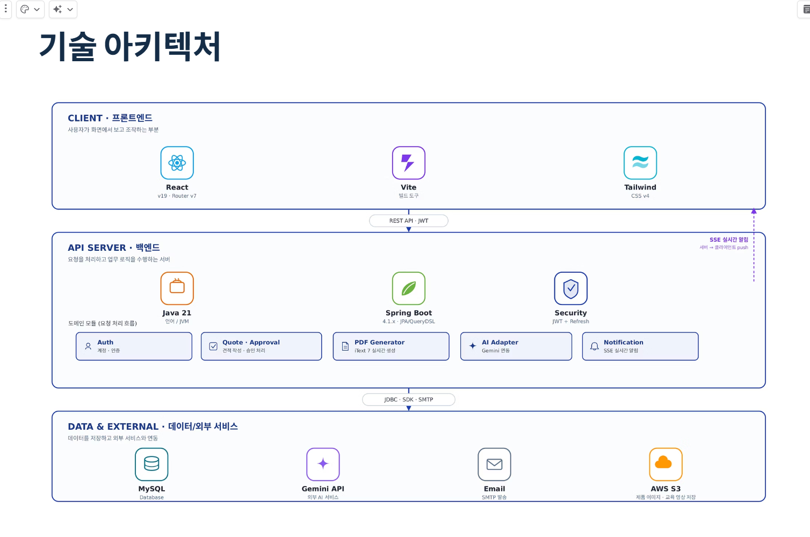

#QuoteGuard - 영업 견적 자동화 및 리스크 검토 기반 승인 관리 시스템

## 프로젝트 소개

**QuoteGuard**는 B2B 영업 견적 작성, 계산, 리스크 검토를 자동화하여 효율적으로 견적서 작성이 가능하고 보조 AI 리스크 분석 기반으로 관리자가 더 정확한 승인 판단을 내릴 수 있도록 돕는 플랫폼입니다.

> 프로젝트 기간: 2026.06.10 ~ 2026.07.08

---

## 주요 기능

### 1.계정·권한·운영관리

- 관리자만 계정 생성 가능, 셀프 회원가입 x
- JWT 로그인/갱신, 초기 비밀번호 설정·비밀번호 재설정
- 역할 기반 접근 제어 (`SUPER_ADMIN` / `SALES_MANAGER` / `SALES_STAFF`)
- 관리자 사용자 CRUD, 부서별 통계
- 관리자 대시보드, 인앱 알림

### 2.견적 작성

- 견적 CRUD, 견적 임시 저장, 만료된 견적 재작성
- 전에 작성한 견적 내용을 복사 후 재작성 가능
- 품목별 할인·VAT·이익률 등 자동 계산
- 작성 완료 시 승인 필요 여부를 자동 판단(승인 필요/ 승인 불필요)
- 할인 정책 스냅샷 저장, 할인 사유 검증
- 작성한 견적 내용 바탕으로 내부 견적 분석 (원가·이익·정책 대비)
- 고객 등록 및 검색, 기존 고객 정보 자동 입력

### 3. 승인

- 작성완료 시 승인 필요 판단 3조건 판정(할인 초과 / 저이익 / 고액)
- 승인 요청·승인·반려·재요청·요청 철회
- SLA 초과 승인 건 인앱 알림 (스케줄러)

### 4. 제품 및 할인 정책 관리

- 관리자가 제품명, 제품코드, 설명, 이미지, 단가, 원가, VAT 적용 여부를 관리
- 대분류, 중분류, 소분류 카테고리를 등록·수정
- 카테고리, 제품명, 키워드, 제품코드로 제품을 검색
- 자주 사용하는 제품은 즐겨찾기로 등록

### 5. 견적 문서 관리 및 발송

- 견적 PDF 생성·엑셀 다운로드
- 견적 이메일 발송·발송 이력 확인
- 견적서 미리보기
- 견적 만료 알림

### 6. 교육(LMS)

- 교육 영상 이수 현황, 가이드 확인
- 관리자 교육 가이드·영상 관리
- 영업 사원, 영업 관리자는 교육 이수 완료 시에만 견적 작성, 승인 검토 가능

### 7. AI 보조 지원

- AI 리스크 요약(Gemini, 한도 초과 시 Groq fallback)
- AI 상담 메모 요약
- 제안 문구 생성

---

## 팀원 역할 분담

| 이름   | 역할 | 담당                                                              |
| ------ | ---- | ----------------------------------------------------------------- |
| 홍창희 | 팀장 | 계정 관리, 인증/인가, 사용자 통계, CI/CD                          |
| 박재석 | 팀원 | 제품 관리 및 탐색, 할인 정책 관리, 통계 대시보드                  |
| 박삼령 | 팀원 | 견적 계산 및 작성, 내부 분석, 고객 관리, 임시 저장, 교육(LMS)     |
| 신현섭 | 팀원 | 승인/반려 처리, 재요청, SLA 알림 및 견적 리마인더, AI 리스크 요약 |
| 박준호 | 팀원 | 견적서 미리보기, PDF/엑셀 다운로드, 이메일 발송, 알림(SSE)        |
| 장채은 | 팀원 | 상담 메모 요약, 제안 문구 생성                                    |

---

## 기술 스택 (Backend)

- **Java 21**, **Spring Boot 4.1.0**
- **JPA/Hibernate**, **QueryDSL 5.1** (Jakarta)
- **MySQL 8**, **JWT** (Access + Refresh, jjwt)
- Spring Security, Spring Validation, Spring Mail
- Gradle (빌드 도구)
- iText7 (PDF)
- AWS S3
- Gemini / Groq (AI 리스크 요약)
- spring-dotenv (`.env` 로컬 환경 변수)

## 시스템 구성 (전체)

| 구분     | 기술                                                                             |
| -------- | -------------------------------------------------------------------------------- |
| Frontend | React, Vite, React Router — [front 저장소](https://github.com/QuoteGuards/front) |
| Backend  | Spring Boot REST API (본 저장소)                                                 |
| DB       | MySQL (`sql/QuoteGuard.sql`)                                                     |
| CI/CD    | GitHub Actions, Docker Compose                                                   |
| 외부     | AWS S3, SMTP, Gemini API                                                         |

---

## ERD

- DB 스크립트: [`sql/QuoteGuard.sql`](./sql/QuoteGuard.sql)
- ERD 다이어그램: 

---

## 실행 방법 (프론트 / 백엔드 공통)

### 1. 사전 요구 사항

| 항목             | 버전 |
| ---------------- | ---- |
| JDK              | 21   |
| MySQL            | 8+   |
| Node.js (프론트) | 18+  |
| Git              | 최신 |

### 2. 저장소 클론

```bash
# 백엔드
git clone https://github.com/QuoteGuards/back.git
cd back

# 프론트엔드 (별도 터미널)
git clone https://github.com/QuoteGuards/front.git
cd front
```

### 3. DB 준비

MySQL 접속 후 QuoteGuard.sql 실행

### 4. 백엔드 환경 설정

.env 파일 생성 후 다음 정보 입력

```
# QuoteGuard 환경변수 템플릿

# ── Database ──
DB_SCHEMA_NAME=quoteguard
DB_USERNAME=
DB_PASSWORD=

# ── JWT ── (512bit base64 문자열)
JWT_SECRET=

# ── Mail (SMTP) ──
MAIL_HOST=smtp.gmail.com
MAIL_PORT=587
MAIL_USERNAME=
MAIL_PASSWORD=
MAIL_FROM=
MAIL_FROM_NAME=QuoteGuard

# ── File Storage (local | s3) ──
STORAGE_TYPE=local
STORAGE_PUBLIC_BASE_URL=http://localhost:8080
STORAGE_LOCAL_DIR=./uploads
STORAGE_TYPE=s3
S3_BUCKET=
S3_REGION=ap-northeast-2
AWS_ACCESS_KEY_ID=
AWS_SECRET_ACCESS_KEY=
S3_PUBLIC_URL=

# ── Gemini (AI) ──
GEMINI_API_KEY=

```

### 5. 백엔드 실행(API 기본 URL: http://localhost:8080)

# Windows

```bash
gradlew.bat bootRun
```

# macOS / Linux

```bash
./gradlew bootRun
```

### 6. 프론트엔드 환경 설정/실행(프론트 기본 URL: http://localhost:5173)

```bash
cd front
npm install
npm run dev
```

---

## 패키지 구조

```
src/main/java/com/project/back/
├── ai/
├── domain/
│   ├── approval/          # 승인 요청·승인·반려·재요청
│   ├── auth/              # 인증·토큰·비밀번호
│   ├── category/          # 카테고리
│   ├── customer/          # 거래처
│   ├── dashboard/         # 대시보드
│   ├── discount/          # 할인 정책
│   ├── document/          # PDF 문서
│   ├── email/             # 견적 이메일·발송 이력
│   ├── product/           # 제품
│   ├── quote/             # 견적·금액 계산·내부분석
│   ├── training/          # 교육 이수
│   └── user/              # 사용자·계정
├── notification/          # 인앱 알림·SSE
└── global/                # 보안·예외·공통·스토리지
    ├── client/
    ├── common/
    ├── config/
    ├── enums/
    ├── exception/
    ├── security/
    └── storage/
```

---

## API 명세

| 방식            | 링크                                                                                           |
| --------------- | ---------------------------------------------------------------------------------------------- |
| Notion API 문서 | _https://app.notion.com/p/38325e891fd6800ea3d9d2ade1b37086?v=38325e891fd6804d9628000c1f0def61_ |

---

## 아키텍처 개요


---

## 협업

비즈니스 규칙 : 노션 링크
코드 리뷰: CodeRabbit
프론트 저장소: https://github.com/QuoteGuards/front
